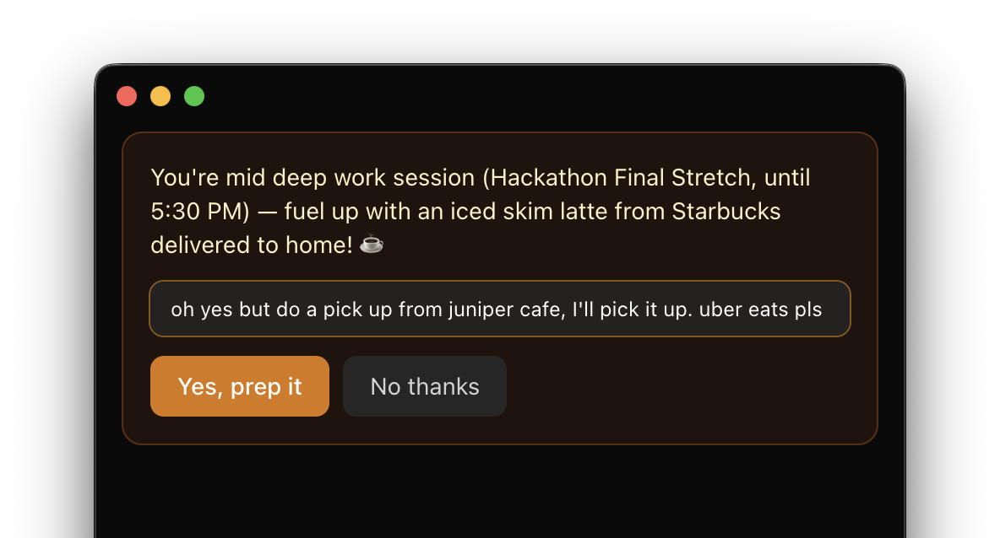
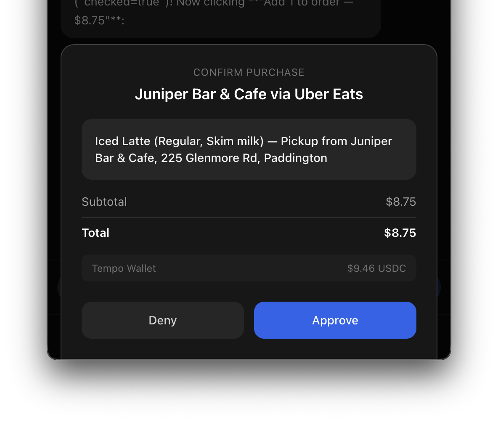
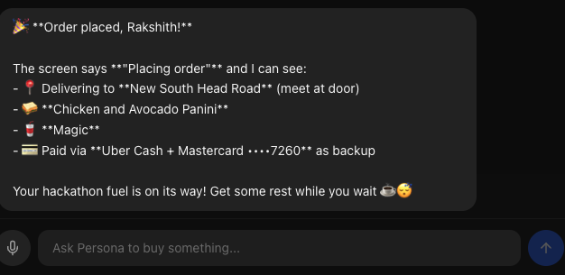

# Persona

A voice-first AI purchasing agent that buys things for you. Say what you want, approve the purchase, and Persona handles the rest — from searching merchants to checkout and payment.

Built with the [Claude Agent SDK](https://platform.claude.com/docs/en/agent-sdk/overview), [Open Wallet Standard (OWS)](https://openwallet.sh/), and [Bitrefill](https://www.bitrefill.com/) for the [OWS Hackathon](https://hackathon.openwallet.sh/).

<p align="center">
  
</p>

<p align="center">
  
  
</p>

## How It Works

```
You: "Order me an iced latte from Uber Eats"

Persona: Opens Uber Eats in your Chrome → finds Starbucks nearby →
         adds iced latte to cart → navigates to checkout →
         shows approval card with price breakdown

You: [Approve]

Persona: Buys gift card via Bitrefill (USDC → x402) →
         applies at checkout → order placed.
         "Ordered! Pickup in 10 minutes."
```

## Architecture

```
Electron App (React + TypeScript)
  ├── Chat UI — voice input (Moonshine STT), streaming text, approval cards
  ├── Orders — purchase history from SQLite
  ├── Wallet — OWS balance, fund via MoonPay
  └── Settings — profile editor, bank statement upload

Python Agent (Claude Agent SDK)
  ├── Main agent — persistent session, prompt caching (~15k tokens)
  ├── Proactive engine — 3-stage suggestion flow (decide → notify → execute)
  ├── Skills — browser-use CLI, Bitrefill CLI
  └── Context — profile.json, recurring.json, Google Calendar MCP

Payment Flow:
  OWS Wallet (USDC on Base) → Bitrefill x402 → Gift Card → Merchant Checkout
```

## Features

**Reactive purchasing:**
- Voice or text input
- Web search for product research
- Browser automation (browser-use CLI with your Chrome profile)
- Approval card before any payment
- Bitrefill gift cards via x402 (merchant-specific or Visa)
- OWS wallet with policy-gated signing
- Order tracking in SQLite

**Proactive suggestions:**
- Google Calendar integration — suggests coffee before deep work, gifts before birthdays
- Bank statement analysis — CSV upload, finds recurring purchases, suggests reorders
- 3-stage flow: lightweight decision check → user confirms → separate execution session
- Main chat stays free during proactive execution

**Voice:**
- Moonshine JS — on-device STT, runs in browser via WASM
- Web Speech API fallback

## Tech Stack

| Layer | Technology |
|-------|-----------|
| Desktop | Electron + React + TypeScript + Tailwind |
| Agent | Claude Agent SDK (Python) |
| STT | Moonshine JS (WASM, in-browser) |
| Wallet | OWS (Open Wallet Standard) |
| Payment | Bitrefill CLI (x402, USDC on Base) |
| Browser | browser-use CLI (headed Chrome, user profile) |
| Calendar | Google Calendar MCP |
| Database | SQLite (sql.js) |
| State | Zustand |

## Setup

### Prerequisites

- Node.js 18+
- Python 3.11+
- [OWS CLI](https://openwallet.sh/): `npm install -g @open-wallet-standard/core`
- [Bitrefill CLI](https://github.com/bitrefill/cli): `npm install -g @bitrefill/cli`
- [browser-use CLI](https://github.com/browser-use/browser-use): installed via pip

### Install

```bash
git clone https://github.com/rakshith48/persona-ows.git
cd persona-ows

# Node dependencies
npm install

# Python agent
cd agent
python3 -m venv .venv
source .venv/bin/activate
pip install -e .
cd ..
```

### Configure

```bash
# Copy env template
cp .env.example .env

# OWS wallet auto-creates on first run
# Fund it:
ows fund deposit --wallet persona-agent

# Bitrefill auth (browser OAuth):
bitrefill logout && bitrefill search-products --query "test"
```

### Run

```bash
npm run dev
```

The app opens with an onboarding flow:
1. Wallet auto-creates
2. Fund with crypto (MoonPay or direct transfer)
3. Connect Google Calendar
4. Start shopping

## Project Structure

```
persona-ows/
├── src/
│   ├── main/           # Electron main process
│   ├── renderer/       # React app (chat, orders, wallet, settings)
│   └── preload/        # IPC bridge
├── agent/
│   ├── agent.py        # Main agent (Claude Agent SDK + custom MCP tools)
│   ├── proactive.py    # 3-stage proactive suggestion engine
│   ├── main.py         # stdio server + proactive loop
│   ├── config.py       # Environment config
│   ├── context/        # profile.json, recurring.json, location.json
│   └── services/       # OWS wallet, Zinc API, Bitrefill client
├── .claude/
│   └── skills/         # browser-use, bitrefill-cli skills
└── .mcp.json           # Google Calendar MCP
```

## Hackathon

Built for the [OWS Hackathon](https://hackathon.openwallet.sh/) (April 3, 2026).

**Track 1: Agentic Storefronts & Real-World Commerce** — AI personal shopper that uses OWS wallet with policy-enforced spending to buy real products autonomously.

**Track 5: Creative** — "The Agent That Orders Lunch" — proactive agent that reads your calendar and orders coffee before your deep work session.

## License

MIT
